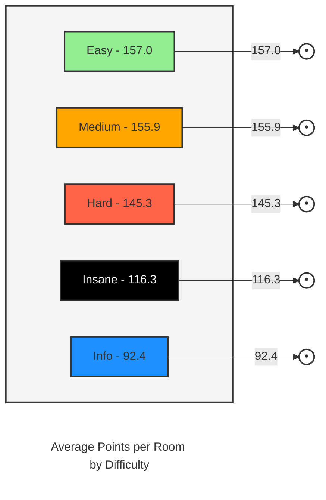

1. It takes Ryans (0days completed room) to get a list of room codes. (He hasn't done all the rooms, so I could run it against someone else or pull them another way)
2. It requests each rooms leaderboard API to find the points for each. 

# Total points added without first bloods: 130,286 or an average of 152.73 points per room. 
As of todays date: 20/10/2024 - You need:
- 116,804 points to be in the top 50 world
- 100,064 points to be top 150 world
- 73,875 points to be top 500 world
- 65,896 points to be top 700 world
- 58,172 points to be top 1,000 world
---
- Completing all the rooms listed below would make you rank 6 overall. 
- Doing the top 10 point rooms listed will give you 11,906 points or around rank 50,000
- Doing the top 20 point rooms listed will give you 20,020 points or around rank 13,815
- Doing the top 30 point rooms listed will give you 26,640 points or around rank 7,000
- Doing the top 50 point rooms listed will give you 36,506 points or around rank 3,000
- Doing the top 100 point rooms listed will give you 53,592 points or around rank 1,234

>> Also introduced is the ability to grab your completed rooms already and nicely output what needs to be done. Get your USER hash by visiting your profile and monitoring your network tab. You should see a request like this
```https://tryhackme.com/api/v2/public-profile/completed-rooms?user=659d12cf86b9ed139d4d1753&limit=16&page=1```

Take that hash and put it into the script check_your_stats.py like so:
1. ```git clone https://github.com/pentestfunctions/thm-room-points.git```

2. ```cd thm-room-points```

3. ```python check_your_stats.py HASH```

> Replace HASH with your profile HASH.
 This will give you 2 files. completed_rooms.txt and rooms_to_complete.txt with the order of highest points at the top.
---


# TryHackMe Room Difficulty Summary

| Difficulty | Total Points | Number of Rooms | Average Points per Room |
|------------|------------:|----------------:|------------------------:|
| 🟢 Easy    | 60,752      | 387             | 157.0 |
| 🟠 Medium  | 55,038      | 353             | 155.9 |
| 🔴 Hard    | 10,610      | 73              | 145.3 |
| ⚫ Insane  | 930         | 8               | 116.3 |
| ℹ️ Info    | 2,956       | 32              | 92.4  |

## Statistics

- **Total Rooms**: 853
- **Total Points**: 130,286
- **Overall Average Points per Room**: 152.7

## Average Points per Room by Difficulty



> This summary provides an overview of the TryHackMe rooms categorized by difficulty, showing the total points, number of rooms, and average points per room for each category. The graph visualizes the average points per room across difficulty levels.


| Room Name | Room URL | Points | Difficulty |
|-----------|----------|--------|------------|
| Advent of Cyber 1 [2019] | https://tryhackme.com/room/25daysofchristmas | 2160 | 🟢 Easy |
| Introductory Networking | https://tryhackme.com/room/introtonetworking | 1320 | 🟢 Easy |
| Squid Game | https://tryhackme.com/room/squidgameroom | 1230 | 🔴 Hard |
| Snort Challenge - The Basics | https://tryhackme.com/room/snortchallenges1 | 1140 | 🟡 Medium |
| Advent of Cyber 3 (2021) | https://tryhackme.com/room/adventofcyber3 | 1064 | 🟢 Easy |
| Toolbox: Vim  | https://tryhackme.com/room/toolboxvim | 1050 | 🟢 Easy |
| Advent of Cyber 2022 | https://tryhackme.com/room/adventofcyber4 | 1040 | 🟢 Easy |
| GoldenEye | https://tryhackme.com/room/goldeneye | 1020 | 🟡 Medium |
| Binex | https://tryhackme.com/room/binex | 970 | 🟡 Medium |
| Advent of Cyber 2 [2020] | https://tryhackme.com/room/adventofcyber2 | 912 | 🟢 Easy |
| 25 Days of Cyber Security | https://tryhackme.com/room/learncyberin25days | 904 | 🟢 Easy |
| Investigating Windows 2.0 | https://tryhackme.com/room/investigatingwindows2 | 900 | 🟡 Medium |
| Investigating Windows 3.x | https://tryhackme.com/room/investigatingwindows3 | 900 | 🟡 Medium |
| Advent of Cyber 2023 | https://tryhackme.com/room/adventofcyber2023 | 880 | 🟢 Easy |
| tomghost | https://tryhackme.com/room/tomghost | 810 | 🟢 Easy |
| Hacking with PowerShell | https://tryhackme.com/room/powershell | 810 | 🟢 Easy |
| Borderlands | https://tryhackme.com/room/borderlands | 750 | 🔴 Hard |
| NahamStore | https://tryhackme.com/room/nahamstore | 720 | 🟡 Medium |
| CI/CD and Build Security | https://tryhackme.com/room/cicdandbuildsecurity | 720 | 🟡 Medium |
| WebOSINT | https://tryhackme.com/room/webosint | 720 | 🟢 Easy |
| Masterminds | https://tryhackme.com/room/mastermindsxlq | 690 | 🟡 Medium |
| Retro | https://tryhackme.com/room/retro | 690 | 🔴 Hard |
| Ice | https://tryhackme.com/room/ice | 690 | 🟢 Easy |
| Attacktive Directory | https://tryhackme.com/room/attacktivedirectory | 690 | 🟡 Medium |
| MAL: Malware Introductory | https://tryhackme.com/room/malmalintroductory | 660 | 🟢 Easy |
| Searchlight - IMINT | https://tryhackme.com/room/searchlightosint | 660 | 🟢 Easy |
| Dumping Router Firmware | https://tryhackme.com/room/rfirmware | 660 | 🟡 Medium |
| Biohazard | https://tryhackme.com/room/biohazard | 630 | 🟡 Medium |
| Blue | https://tryhackme.com/room/blue | 630 | 🟢 Easy |
| c4ptur3-th3-fl4g | https://tryhackme.com/room/c4ptur3th3fl4g | 620 | 🟢 Easy |
| Wreath | https://tryhackme.com/room/wreath | 616 | 🟢 Easy |
| Carnage | https://tryhackme.com/room/c2carnage | 600 | 🟡 Medium |
| CTF collection Vol.2 | https://tryhackme.com/room/ctfcollectionvol2 | 600 | 🟡 Medium |
| CTF collection Vol.1 | https://tryhackme.com/room/ctfcollectionvol1 | 600 | 🟢 Easy |
| Crack The Hash Level 2 | https://tryhackme.com/room/crackthehashlevel2 | 570 | 🟡 Medium |
| tmux | https://tryhackme.com/room/rptmux | 510 | 🟢 Easy |
| REmux The Tmux | https://tryhackme.com/room/tmuxremux | 480 | 💡Info |
| Wifi Hacking 101 | https://tryhackme.com/room/wifihacking101 | 480 | 🟢 Easy |
| Investigating Windows | https://tryhackme.com/room/investigatingwindows | 480 | 🟢 Easy |
| Sakura Room | https://tryhackme.com/room/sakura | 450 | 🟢 Easy |
| Jupyter 101 | https://tryhackme.com/room/jupyter101 | 450 | 🟢 Easy |
| Common Linux Privesc | https://tryhackme.com/room/commonlinuxprivesc | 450 | 🟢 Easy |
| Google Dorking | https://tryhackme.com/room/googledorking | 450 | 🟢 Easy |
| REvil Corp | https://tryhackme.com/room/revilcorp | 450 | 🟡 Medium |
| Boogeyman 2 | https://tryhackme.com/room/boogeyman2 | 450 | 🟡 Medium |
| Disk Analysis & Autopsy | https://tryhackme.com/room/autopsy2ze0 | 450 | 🟡 Medium |
| Boogeyman 3 | https://tryhackme.com/room/boogeyman3 | 450 | 🟡 Medium |
| HA Joker CTF | https://tryhackme.com/room/jokerctf | 450 | 🟡 Medium |
| Network Services 2 | https://tryhackme.com/room/networkservices2 | 440 | 🟢 Easy |
| Learn Rust | https://tryhackme.com/room/rust | 440 | 🟢 Easy |
| Holo | https://tryhackme.com/room/hololive | 424 | 🔴 Hard |
| h4cked | https://tryhackme.com/room/h4cked | 420 | 🟢 Easy |
| Anthem | https://tryhackme.com/room/anthem | 420 | 🟢 Easy |
| Zeek Exercises | https://tryhackme.com/room/zeekbroexercises | 420 | 🟡 Medium |
| Vulnversity | https://tryhackme.com/room/vulnversity | 398 | 🟢 Easy |
| The Cod Caper | https://tryhackme.com/room/thecodcaper | 390 | 🟢 Easy |
| Agent Sudo | https://tryhackme.com/room/agentsudoctf | 390 | 🟢 Easy |
| Introductory Researching | https://tryhackme.com/room/introtoresearch | 390 | 🟢 Easy |
| Break it | https://tryhackme.com/room/breakit | 360 | 🟡 Medium |
| IronShade | https://tryhackme.com/room/ironshade | 360 | 🟡 Medium |
| Poster | https://tryhackme.com/room/poster | 360 | 🟢 Easy |
| The Greenholt Phish | https://tryhackme.com/room/phishingemails5fgjlzxc | 360 | 🟢 Easy |
| Forensics  | https://tryhackme.com/room/forensics | 360 | 🔴 Hard |
| CMSpit | https://tryhackme.com/room/cmspit | 360 | 🟡 Medium |
| Warzone 1 | https://tryhackme.com/room/warzoneone | 360 | 🟡 Medium |
| HackPark | https://tryhackme.com/room/hackpark | 360 | 🟡 Medium |
| Juicy Details | https://tryhackme.com/room/juicydetails | 360 | 🟢 Easy |
| Network Services | https://tryhackme.com/room/networkservices | 344 | 🟢 Easy |
| Linux Agency | https://tryhackme.com/room/linuxagency | 336 | 🟡 Medium |
| OWASP Top 10 | https://tryhackme.com/room/owasptop10 | 336 | 🟢 Easy |
| ToolsRus | https://tryhackme.com/room/toolsrus | 330 | 🟢 Easy |
| RazorBlack | https://tryhackme.com/room/raz0rblack | 330 | 🟡 Medium |
| Easy Peasy | https://tryhackme.com/room/easypeasyctf | 330 | 🟢 Easy |
| Brute It | https://tryhackme.com/room/bruteit | 330 | 🟢 Easy |
| CyberCrafted | https://tryhackme.com/room/cybercrafted | 330 | 🟡 Medium |
| Game Zone | https://tryhackme.com/room/gamezone | 330 | 🟢 Easy |
| Snapped Phish-ing Line | https://tryhackme.com/room/snappedphishingline | 330 | 🟢 Easy |
| Kenobi | https://tryhackme.com/room/kenobi | 330 | 🟢 Easy |
| Nmap | https://tryhackme.com/room/furthernmap | 320 | 🟢 Easy |
| History of Malware | https://tryhackme.com/room/historyofmalware | 312 | 💡Info |
| Year of the Rabbit | https://tryhackme.com/room/yearoftherabbit | 310 | 🟢 Easy |
| Boiler CTF | https://tryhackme.com/room/boilerctf2 | 300 | 🟡 Medium |
| Dunkle Materie | https://tryhackme.com/room/dunklematerieptxc9 | 300 | 🟡 Medium |
| Conti | https://tryhackme.com/room/contiransomwarehgh | 300 | 🟡 Medium |
| Benign | https://tryhackme.com/room/benign | 300 | 🟡 Medium |
| Disgruntled | https://tryhackme.com/room/disgruntled | 300 | 🟢 Easy |
| TShark Challenge II: Directory | https://tryhackme.com/room/tsharkchallengestwo | 300 | 🟢 Easy |
| PS Eclipse | https://tryhackme.com/room/posheclipse | 300 | 🟡 Medium |
| Mnemonic | https://tryhackme.com/room/mnemonic | 300 | 🟡 Medium |
| JVM Reverse Engineering | https://tryhackme.com/room/jvmreverseengineering | 300 | 🟡 Medium |
| M4tr1x: Exit Denied | https://tryhackme.com/room/m4tr1xexitdenied | 300 | 🔴 Hard |
| K2 | https://tryhackme.com/room/k2room | 300 | 🔴 Hard |
| PWN101 | https://tryhackme.com/room/pwn101 | 300 | 🟡 Medium |
| hackerNote | https://tryhackme.com/room/hackernote | 300 | 🟡 Medium |
| Simple CTF | https://tryhackme.com/room/easyctf | 300 | 🟢 Easy |
| Warzone 2 | https://tryhackme.com/room/warzonetwo | 300 | 🟡 Medium |
| New Hire Old Artifacts | https://tryhackme.com/room/newhireoldartifacts | 300 | 🟡 Medium |
| TryHack3M: Subscribe | https://tryhackme.com/room/subscribe | 300 | 🟡 Medium |
| AllSignsPoint2Pwnage | https://tryhackme.com/room/allsignspoint2pwnage | 300 | 🟡 Medium |
| PrintNightmare, thrice! | https://tryhackme.com/room/printnightmarec3kj | 300 | 🟡 Medium |
| Linux Modules | https://tryhackme.com/room/linuxmodules | 296 | 🟢 Easy |
| Physical Security Intro | https://tryhackme.com/room/physicalsecurityintro | 296 | 🟢 Easy |
| Tempest | https://tryhackme.com/room/tempestincident | 288 | 🟡 Medium |
| Redline | https://tryhackme.com/room/btredlinejoxr3d | 272 | 🟡 Medium |
| Atomic Red Team | https://tryhackme.com/room/atomicredteam | 272 | 🟡 Medium |
| Digital Forensics Case B4DM755 | https://tryhackme.com/room/caseb4dm755 | 272 | 🟢 Easy |
| Couch | https://tryhackme.com/room/couch | 270 | 🟢 Easy |
| Tokyo Ghoul | https://tryhackme.com/room/tokyoghoul666 | 270 | 🟡 Medium |
| One Piece | https://tryhackme.com/room/ctfonepiece65 | 270 | 🟡 Medium |
| Crack the hash | https://tryhackme.com/room/crackthehash | 270 | 🟢 Easy |
| Jurassic Park | https://tryhackme.com/room/jurassicpark | 270 | 🔴 Hard |
| Reversing ELF | https://tryhackme.com/room/reverselfiles | 270 | 🟢 Easy |
| Investigating with Splunk | https://tryhackme.com/room/investigatingwithsplunk | 270 | 🟡 Medium |
| UltraTech | https://tryhackme.com/room/ultratech1 | 270 | 🟡 Medium |
| PrintNightmare, again! | https://tryhackme.com/room/printnightmarec2bn7l | 270 | 🟢 Easy |
| SigHunt | https://tryhackme.com/room/sighunt | 270 | 🟡 Medium |
| Splunk 3 | https://tryhackme.com/room/splunk3zs | 264 | 🟡 Medium |
| OhSINT | https://tryhackme.com/room/ohsint | 260 | 🟢 Easy |
| Wireshark: Traffic Analysis | https://tryhackme.com/room/wiresharktrafficanalysis | 256 | 🟡 Medium |
| Recovery | https://tryhackme.com/room/recovery | 255 | 🟡 Medium |
| L2 MAC Flooding & ARP Spoofing | https://tryhackme.com/room/layer2 | 248 | 🟢 Easy |
| Nax | https://tryhackme.com/room/nax | 240 | 🟡 Medium |
| Windows Event Logs | https://tryhackme.com/room/windowseventlogs | 240 | 🟡 Medium |
| Sweettooth Inc. | https://tryhackme.com/room/sweettoothinc | 240 | 🟡 Medium |
| Mobile Malware Analysis | https://tryhackme.com/room/mma | 240 | 🟢 Easy |
| Steel Mountain | https://tryhackme.com/room/steelmountain | 240 | 🟢 Easy |
| Wordpress: CVE-2021-29447 | https://tryhackme.com/room/wordpresscve202129447 | 240 | 🟢 Easy |
| MITRE | https://tryhackme.com/room/mitre | 240 | 🟡 Medium |
| Net Sec Challenge | https://tryhackme.com/room/netsecchallenge | 240 | 🟡 Medium |
| Tony the Tiger | https://tryhackme.com/room/tonythetiger | 240 | 🟢 Easy |
| CALDERA | https://tryhackme.com/room/caldera | 240 | 🔴 Hard |
| Ra | https://tryhackme.com/room/ra | 240 | 🔴 Hard |
| dogcat | https://tryhackme.com/room/dogcat | 235 | 🟡 Medium |
| Regular expressions | https://tryhackme.com/room/catregex | 232 | 🟡 Medium |
| Snort | https://tryhackme.com/room/snort | 232 | 🟡 Medium |
| Linux Strength Training | https://tryhackme.com/room/linuxstrengthtraining | 224 | 🟢 Easy |
| Windows Incident Surface | https://tryhackme.com/room/winincidentsurface | 224 | 🟢 Easy |
| NIS - Linux Part I | https://tryhackme.com/room/nislinuxone | 224 | 🟢 Easy |
| Splunk 2 | https://tryhackme.com/room/splunk2gcd5 | 224 | 🟡 Medium |
| OSI Model | https://tryhackme.com/room/osimodelzi | 224 | 💡Info |
| Windows Forensics 1 | https://tryhackme.com/room/windowsforensics1 | 216 | 🟡 Medium |
| Hacking Hadoop | https://tryhackme.com/room/hackinghadoop | 216 | 🔴 Hard |
| Zeek | https://tryhackme.com/room/zeekbro | 216 | 🟡 Medium |
| Archangel | https://tryhackme.com/room/archangel | 210 | 🟢 Easy |
| ItsyBitsy | https://tryhackme.com/room/itsybitsy | 210 | 🟡 Medium |
| Intranet | https://tryhackme.com/room/securesolacodersintra | 210 | 🟡 Medium |
| Watcher | https://tryhackme.com/room/watcher | 210 | 🟡 Medium |
| Monday Monitor | https://tryhackme.com/room/mondaymonitor | 210 | 🟢 Easy |
| Bebop | https://tryhackme.com/room/bebop | 210 | 🟢 Easy |
| RootMe | https://tryhackme.com/room/rrootme | 210 | 🟢 Easy |
| Unstable Twin | https://tryhackme.com/room/unstabletwin | 210 | 🟡 Medium |
| Hamlet | https://tryhackme.com/room/hamlet | 210 | 🟡 Medium |
| TryPwnMe One | https://tryhackme.com/room/trypwnmeone | 210 | 🟡 Medium |
| Mother's Secret | https://tryhackme.com/room/codeanalysis | 210 | 🟢 Easy |
| Friday Overtime | https://tryhackme.com/room/fridayovertime | 210 | 🟡 Medium |
| Res | https://tryhackme.com/room/res | 210 | 🟢 Easy |
| Mr Robot CTF | https://tryhackme.com/room/mrrobot | 210 | 🟡 Medium |
| Linux Privilege Escalation | https://tryhackme.com/room/linprivesc | 208 | 🟡 Medium |
| Python for Pentesters | https://tryhackme.com/room/pythonforcybersecurity | 208 | 🟢 Easy |
| Logstash: Data Processing Unit | https://tryhackme.com/room/logstash | 208 | 🟡 Medium |
| OWASP Top 10 - 2021 | https://tryhackme.com/room/owasptop102021 | 208 | 🟢 Easy |
| NetworkMiner | https://tryhackme.com/room/networkminer | 200 | 🟢 Easy |
| APIWizards Breach | https://tryhackme.com/room/apiwizardsbreach | 200 | 🟡 Medium |
| Identity and Access Management | https://tryhackme.com/room/iaaaidm | 192 | 🟢 Easy |
| Firewalls | https://tryhackme.com/room/redteamfirewalls | 192 | 🟡 Medium |
| Velociraptor | https://tryhackme.com/room/velociraptorhp | 192 | 🟡 Medium |
| Exploiting Active Directory | https://tryhackme.com/room/exploitingad | 192 | 🟡 Medium |
| Intro To Pwntools | https://tryhackme.com/room/introtopwntools | 184 | 🟢 Easy |
| Yara | https://tryhackme.com/room/yara | 184 | 🟢 Easy |
| PrintNightmare | https://tryhackme.com/room/printnightmarehpzqlp8 | 184 | 🟡 Medium |
| x86 Assembly Crash Course | https://tryhackme.com/room/x86assemblycrashcourse | 184 | 🟡 Medium |
| Advanced Static Analysis | https://tryhackme.com/room/advancedstaticanalysis | 184 | 🟡 Medium |
| Lian_Yu | https://tryhackme.com/room/lianyu | 180 | 🟢 Easy |
| CCT2019 | https://tryhackme.com/room/cct2019 | 180 | <span style="color: purple">insane</span> |
| Advent of Cyber '23 Side Quest | https://tryhackme.com/room/adventofcyber23sidequest | 180 | 💡Info |
| Anonymous | https://tryhackme.com/room/anonymous | 180 | 🟡 Medium |
| Dead End? | https://tryhackme.com/room/deadend | 180 | 🔴 Hard |
| Basic Pentesting | https://tryhackme.com/room/basicpentestingjt | 180 | 🟢 Easy |
| Profiles | https://tryhackme.com/room/profilesroom | 180 | 🟡 Medium |
| Buffer Overflows | https://tryhackme.com/room/bof1 | 180 | 🟢 Easy |
| Block | https://tryhackme.com/room/blockroom | 180 | 🟡 Medium |
| Summit | https://tryhackme.com/room/summit | 180 | 🟢 Easy |
| Sustah | https://tryhackme.com/room/sustah | 180 | 🟡 Medium |
| Lunizz CTF | https://tryhackme.com/room/lunizzctfnd | 180 | 🟡 Medium |
| Clocky | https://tryhackme.com/room/clocky | 180 | 🟡 Medium |
| NanoCherryCTF | https://tryhackme.com/room/nanocherryctf | 180 | 🟡 Medium |
| Shodan.io | https://tryhackme.com/room/shodan | 180 | 🟢 Easy |
| TryHack3M: Bricks Heist | https://tryhackme.com/room/tryhack3mbricksheist | 180 | 🟢 Easy |
| Avengers Blog | https://tryhackme.com/room/avengers | 180 | 🟢 Easy |
| Breaking RSA | https://tryhackme.com/room/breakrsa | 180 | 🟡 Medium |
| Ninja Skills | https://tryhackme.com/room/ninjaskills | 180 | 🟢 Easy |
| Alfred | https://tryhackme.com/room/alfred | 180 | 🟢 Easy |
| Snort Challenge - Live Attacks | https://tryhackme.com/room/snortchallenges2 | 180 | 🟡 Medium |
| REloaded | https://tryhackme.com/room/reloaded | 180 | 🔴 Hard |
| kiba | https://tryhackme.com/room/kiba | 180 | 🟢 Easy |
| Corp | https://tryhackme.com/room/corp | 180 | 🟢 Easy |
| Uranium CTF | https://tryhackme.com/room/uranium | 180 | 🔴 Hard |
| John the Ripper: The Basics | https://tryhackme.com/room/johntheripperbasics | 176 | 🟢 Easy |
| Introduction to Windows API | https://tryhackme.com/room/windowsapi | 176 | 🟢 Easy |
| Enumerating Active Directory | https://tryhackme.com/room/adenumeration | 176 | 🟡 Medium |
| Sysmon | https://tryhackme.com/room/sysmon | 176 | 🟢 Easy |
| HTTP in Detail | https://tryhackme.com/room/httpindetail | 176 | 🟢 Easy |
| Hip Flask | https://tryhackme.com/room/hipflask | 174 | 🟡 Medium |
| ConvertMyVideo | https://tryhackme.com/room/convertmyvideo | 170 | 🟡 Medium |
| Intro to Kubernetes | https://tryhackme.com/room/introtok8s | 168 | 🟢 Easy |
| Content Security Policy | https://tryhackme.com/room/csp | 168 | 🟡 Medium |
| AV Evasion: Shellcode | https://tryhackme.com/room/avevasionshellcode | 168 | 🟡 Medium |
| Cloud-based IaC | https://tryhackme.com/room/cloudbasediac | 168 | 🟡 Medium |
| Ra 2 | https://tryhackme.com/room/ra2 | 165 | 🔴 Hard |
| CSRF | https://tryhackme.com/room/csrfV2 | 160 | 🟡 Medium |
| Misguided Ghosts | https://tryhackme.com/room/misguidedghosts | 160 | 🔴 Hard |
| Linux System Hardening | https://tryhackme.com/room/linuxsystemhardening | 160 | 🟡 Medium |
| Persisting Active Directory | https://tryhackme.com/room/persistingad | 160 | 🟡 Medium |
| Session Management | https://tryhackme.com/room/sessionmanagement | 160 | 🟢 Easy |
| XSS | https://tryhackme.com/room/axss | 160 | 🟢 Easy |
| Intro to Docker | https://tryhackme.com/room/introtodockerk8pdqk | 160 | 🟢 Easy |
| Buffer Overflow Prep | https://tryhackme.com/room/bufferoverflowprep | 160 | 🟢 Easy |
| Breaching Active Directory | https://tryhackme.com/room/breachingad | 160 | 🟡 Medium |
| ISO27001 | https://tryhackme.com/room/iso27001 | 160 | 🟢 Easy |
| Eradication & Remediation | https://tryhackme.com/room/eradicationandremediation | 160 | 🟢 Easy |
| Incident handling with Splunk | https://tryhackme.com/room/splunk201 | 160 | 🟡 Medium |
| Looking Glass | https://tryhackme.com/room/lookingglass | 160 | 🟡 Medium |
| Hardening Basics Part 1 | https://tryhackme.com/room/hardeningbasicspart1 | 160 | 🟢 Easy |
| KAPE | https://tryhackme.com/room/kape | 160 | 🟡 Medium |
| Nmap Live Host Discovery | https://tryhackme.com/room/nmap01 | 160 | 🟡 Medium |
| Year of the Dog | https://tryhackme.com/room/yearofthedog | 160 | 🔴 Hard |
| Wireshark 101 | https://tryhackme.com/room/wireshark | 160 | 🟢 Easy |
| Intro to Pipeline Automation | https://tryhackme.com/room/introtopipelineautomation | 160 | 🟢 Easy |
| Attacking Kerberos | https://tryhackme.com/room/attackingkerberos | 152 | 🟢 Easy |
| Intro to LAN | https://tryhackme.com/room/introtolan | 152 | 💡Info |
| Threat Intelligence Tools | https://tryhackme.com/room/threatinteltools | 152 | 🟢 Easy |
| ffuf | https://tryhackme.com/room/ffuf | 152 | 🟢 Easy |
| Threat Modelling | https://tryhackme.com/room/threatmodelling | 152 | 🟡 Medium |
| Wireshark: Packet Operations | https://tryhackme.com/room/wiresharkpacketoperations | 152 | 🟢 Easy |
| Analysing Volatile Memory | https://tryhackme.com/room/analysingvolatilememory | 152 | 🟡 Medium |
| Boogeyman 1 | https://tryhackme.com/room/boogeyman1 | 152 | 🟡 Medium |
| Phishing Analysis Tools | https://tryhackme.com/room/phishingemails3tryoe | 152 | 🟢 Easy |
| SSDLC | https://tryhackme.com/room/securesdlc | 152 | 🟡 Medium |
| Introduction to DevSecOps | https://tryhackme.com/room/introductiontodevsecops | 152 | 🟡 Medium |
| Different CTF | https://tryhackme.com/room/adana | 150 | 🔴 Hard |
| Dave's Blog | https://tryhackme.com/room/davesblog | 150 | 🔴 Hard |
| broker | https://tryhackme.com/room/broker | 150 | 🟡 Medium |
| Super-Spam | https://tryhackme.com/room/superspamr | 150 | 🟡 Medium |
| SQHell | https://tryhackme.com/room/sqhell | 150 | 🟡 Medium |
| Daily Bugle | https://tryhackme.com/room/dailybugle | 150 | 🔴 Hard |
| Cyborg | https://tryhackme.com/room/cyborgt8 | 150 | 🟢 Easy |
| Grep | https://tryhackme.com/room/greprtp | 150 | 🟢 Easy |
| Kubernetes for Everyone | https://tryhackme.com/room/kubernetesforyouly | 150 | 🟡 Medium |
| Frosteau Busy with Vim | https://tryhackme.com/room/busyvimfrosteau | 150 | <span style="color: purple">insane</span> |
| The Return of the Yeti | https://tryhackme.com/room/adv3nt0fdbopsjcap | 150 | 🔴 Hard |
| Adventure Time | https://tryhackme.com/room/adventuretime | 150 | 🔴 Hard |
| TShark Challenge I: Teamwork | https://tryhackme.com/room/tsharkchallengesone | 150 | 🟢 Easy |
| Skynet | https://tryhackme.com/room/skynet | 150 | 🟢 Easy |
| Bounty Hacker | https://tryhackme.com/room/cowboyhacker | 150 | 🟢 Easy |
| Cooctus Stories | https://tryhackme.com/room/cooctusadventures | 150 | 🟡 Medium |
| Crocc Crew | https://tryhackme.com/room/crocccrew | 150 | <span style="color: purple">insane</span> |
| Binary Heaven | https://tryhackme.com/room/binaryheaven | 150 | 🟡 Medium |
| Blog | https://tryhackme.com/room/blog | 150 | 🟡 Medium |
| Gallery | https://tryhackme.com/room/gallery666 | 150 | 🟢 Easy |
| Chrome | https://tryhackme.com/room/chrome | 150 | 🔴 Hard |
| Intro to Log Analysis | https://tryhackme.com/room/introtologanalysis | 144 | 🟢 Easy |
| Wireshark: The Basics | https://tryhackme.com/room/wiresharkthebasics | 144 | 🟢 Easy |
| Secret Recipe | https://tryhackme.com/room/registry4n6 | 144 | 🟡 Medium |
| Intrusion Detection  | https://tryhackme.com/room/idsevasion | 144 | 🟡 Medium |
| KaffeeSec - SoMeSINT | https://tryhackme.com/room/somesint | 144 | 🟡 Medium |
| Phishing Prevention | https://tryhackme.com/room/phishingemails4gkxh | 144 | 🟢 Easy |
| K8s Runtime Security | https://tryhackme.com/room/k8sruntimesecurity | 144 | 🟡 Medium |
| Unified Kill Chain | https://tryhackme.com/room/unifiedkillchain | 144 | 🟢 Easy |
| Servidae: Log Analysis in ELK | https://tryhackme.com/room/servidae | 144 | 🟢 Easy |
| Network Security Solutions | https://tryhackme.com/room/redteamnetsec | 144 | 🟡 Medium |
| Osquery: The Basics | https://tryhackme.com/room/osqueryf8 | 144 | 🟢 Easy |
| Log Universe | https://tryhackme.com/room/loguniverse | 144 | 🟢 Easy |
| IR Timeline Analysis | https://tryhackme.com/room/dfirtimelineanalysis | 144 | 🟡 Medium |
| Red Team Engagements | https://tryhackme.com/room/redteamengagements | 144 | 🟢 Easy |
| TShark: CLI Wireshark Features | https://tryhackme.com/room/tsharkcliwiresharkfeatures | 144 | 🟡 Medium |
| CMesS | https://tryhackme.com/room/cmess | 140 | 🟡 Medium |
| Registry Persistence Detection | https://tryhackme.com/room/registrypersistencedetection | 136 | 🟢 Easy |
| Nessus | https://tryhackme.com/room/rpnessusredux | 136 | 🟢 Easy |
| Pyramid Of Pain  | https://tryhackme.com/room/pyramidofpainax | 136 | 🟢 Easy |
| Enumeration | https://tryhackme.com/room/enumerationpe | 136 | 🟢 Easy |
| Splunk: Data Manipulation | https://tryhackme.com/room/splunkdatamanipulation | 136 | 🟡 Medium |
| Autopsy | https://tryhackme.com/room/btautopsye0 | 136 | 🟢 Easy |
| Splunk: Exploring SPL | https://tryhackme.com/room/splunkexploringspl | 136 | 🟡 Medium |
| Cluster Hardening | https://tryhackme.com/room/clusterhardening | 136 | 🟡 Medium |
| TShark: The Basics | https://tryhackme.com/room/tsharkthebasics | 136 | 🟢 Easy |
| OWASP API Security Top 10 - 1 | https://tryhackme.com/room/owaspapisecuritytop105w | 136 | 🟡 Medium |
| Attacking ICS Plant #1 | https://tryhackme.com/room/attackingics1 | 136 | 🟢 Easy |
| OWASP Juice Shop | https://tryhackme.com/room/owaspjuiceshop | 136 | 🟢 Easy |
| Windows Internals | https://tryhackme.com/room/windowsinternals | 136 | 🟡 Medium |
| MAL: Researching | https://tryhackme.com/room/malresearching | 136 | 🟢 Easy |
| SAST | https://tryhackme.com/room/sast | 136 | 🟡 Medium |
| Web Enumeration | https://tryhackme.com/room/webenumerationv2 | 136 | 🟢 Easy |
| Expediting Registry Analysis | https://tryhackme.com/room/expregistryforensics | 136 | 🟡 Medium |
| Jack | https://tryhackme.com/room/jack | 135 | 🔴 Hard |
| Overpass 2 - Hacked | https://tryhackme.com/room/overpass2hacked | 131 | 🟢 Easy |
| Hashing - Crypto 101 | https://tryhackme.com/room/hashingcrypto101 | 128 | 🟡 Medium |
| MalDoc: Static Analysis | https://tryhackme.com/room/maldoc | 128 | 🟡 Medium |
| Threat Hunting: Introduction | https://tryhackme.com/room/introductiontothreathunting | 128 | 🟢 Easy |
| Retracted | https://tryhackme.com/room/retracted | 128 | 🟢 Easy |
| Volatility | https://tryhackme.com/room/volatility | 128 | 🟡 Medium |
| Nmap Advanced Port Scans | https://tryhackme.com/room/nmap03 | 128 | 🟡 Medium |
| Wazuh | https://tryhackme.com/room/wazuhct | 128 | 🟡 Medium |
| IR Difficulties and Challenges | https://tryhackme.com/room/irdifficultiesandchallenges | 128 | 🟢 Easy |
| Windows Local Persistence | https://tryhackme.com/room/windowslocalpersistence | 128 | 🟡 Medium |
| Follina MSDT | https://tryhackme.com/room/follinamsdt | 128 | 🟡 Medium |
| Tactical Detection | https://tryhackme.com/room/tacticaldetection | 128 | 🟡 Medium |
| Microsoft Windows Hardening | https://tryhackme.com/room/microsoftwindowshardening | 128 | 🟢 Easy |
| Auditing and Monitoring | https://tryhackme.com/room/auditingandmonitoringse | 128 | 🟢 Easy |
| Active Directory Basics | https://tryhackme.com/room/winadbasics | 128 | 🟢 Easy |
| Windows Applications Forensics | https://tryhackme.com/room/windowsapplications | 128 | 🟡 Medium |
| Linux Logs Investigations | https://tryhackme.com/room/linuxlogsinvestigations | 128 | 🟡 Medium |
| Container Hardening | https://tryhackme.com/room/containerhardening | 120 | 🟢 Easy |
| Blizzard | https://tryhackme.com/room/blizzard | 120 | 🟡 Medium |
| Insecure Deserialisation | https://tryhackme.com/room/insecuredeserialisation | 120 | 🟡 Medium |
| Bulletproof Penguin | https://tryhackme.com/room/bppenguin | 120 | 🟢 Easy |
| Encryption - Crypto 101 | https://tryhackme.com/room/encryptioncrypto101 | 120 | 🟡 Medium |
| New York Flankees | https://tryhackme.com/room/thenewyorkflankees | 120 | 🟡 Medium |
| Critical | https://tryhackme.com/room/critical | 120 | 🟢 Easy |
| Year of the Fox | https://tryhackme.com/room/yotf | 120 | 🔴 Hard |
| Android Malware Analysis  | https://tryhackme.com/room/androidmalwareanalysis | 120 | 🟢 Easy |
| Data Exfiltration | https://tryhackme.com/room/dataxexfilt | 120 | 🔴 Hard |
| Hardening Basics Part 2 | https://tryhackme.com/room/hardeningbasicspart2 | 120 | 🟢 Easy |
| Threat Intelligence for SOC | https://tryhackme.com/room/threatintelligenceforsoc | 120 | 🟡 Medium |
| DOM-Based Attacks | https://tryhackme.com/room/dombasedattacks | 120 | 🟢 Easy |
| AD Tier Model | https://tryhackme.com/room/adtiermodel | 120 | 🟡 Medium |
| MalBuster | https://tryhackme.com/room/malbuster | 120 | 🟡 Medium |
| K8s Best Security Practices | https://tryhackme.com/room/k8sbestsecuritypractices | 120 | 🟡 Medium |
| PalsForLife | https://tryhackme.com/room/palsforlife | 120 | 🟡 Medium |
| Vulnerability Capstone | https://tryhackme.com/room/vulnerabilitycapstone | 120 | 🟢 Easy |
| Intro PoC Scripting | https://tryhackme.com/room/intropocscripting | 120 | 🟢 Easy |
| Brains | https://tryhackme.com/room/brains | 120 | 🟢 Easy |
| Introduction to Cryptography | https://tryhackme.com/room/cryptographyintro | 120 | 🟡 Medium |
| Principles of Security | https://tryhackme.com/room/principlesofsecurity | 120 | 💡Info |
| Introduction to CryptOps | https://tryhackme.com/room/introductiontocryptops | 120 | 🟢 Easy |
| Nmap Basic Port Scans | https://tryhackme.com/room/nmap02 | 120 | 🟢 Easy |
| Frank & Herby make an app | https://tryhackme.com/room/frankandherby | 120 | 🟡 Medium |
| Minotaur's Labyrinth | https://tryhackme.com/room/labyrinth8llv | 120 | 🟡 Medium |
| Windows x64 Assembly | https://tryhackme.com/room/win64assembly | 120 | 🟡 Medium |
| You're in a cave  | https://tryhackme.com/room/inacave | 120 | <span style="color: purple">insane</span> |
| Chocolate Factory | https://tryhackme.com/room/chocolatefactory | 120 | 🟢 Easy |
| Intro to IaC | https://tryhackme.com/room/introtoiac | 120 | 🟢 Easy |
| Linux Live Analysis | https://tryhackme.com/room/linuxliveanalysis | 120 | 🟡 Medium |
| Content Discovery | https://tryhackme.com/room/contentdiscovery | 120 | 🟢 Easy |
| pyLon | https://tryhackme.com/room/pylonzf | 120 | 🟡 Medium |
| Phishing: HiddenEye | https://tryhackme.com/room/phishinghiddeneye | 120 | 🟢 Easy |
| Evading Logging and Monitoring | https://tryhackme.com/room/monitoringevasion | 120 | 🟡 Medium |
| Network Device Hardening | https://tryhackme.com/room/networkdevicehardening | 120 | 🟡 Medium |
| Becoming a First Responder | https://tryhackme.com/room/becomingafirstresponder | 120 | 💡Info |
| Windows User Activity Analysis | https://tryhackme.com/room/windowsuseractivity | 120 | 🟡 Medium |
| b3dr0ck | https://tryhackme.com/room/b3dr0ck | 120 | 🟢 Easy |
| Ghizer | https://tryhackme.com/room/ghizerctf | 120 | 🟡 Medium |
| Geolocating Images | https://tryhackme.com/room/geolocatingimages | 120 | 🟢 Easy |
| VulnNet: Internal | https://tryhackme.com/room/vulnnetinternal | 120 | 🟢 Easy |
| Bash Scripting  | https://tryhackme.com/room/bashscripting | 120 | 🟢 Easy |
| Memory Forensics | https://tryhackme.com/room/memoryforensics | 120 | 🟢 Easy |
| Olympus | https://tryhackme.com/room/olympusroom | 120 | 🟡 Medium |
| DAST | https://tryhackme.com/room/dastzap | 120 | 🟡 Medium |
| Cyber Crisis Management | https://tryhackme.com/room/cybercrisismanagement | 120 | 🟢 Easy |
| Badbyte | https://tryhackme.com/room/badbyte | 120 | 🟢 Easy |
| Gotta Catch'em All! | https://tryhackme.com/room/pokemon | 120 | 🟢 Easy |
| Advanced SQL Injection | https://tryhackme.com/room/advancedsqlinjection | 120 | 🟡 Medium |
| Crylo | https://tryhackme.com/room/crylo4a | 120 | 🟡 Medium |
| Theseus | https://tryhackme.com/room/theseus | 120 | <span style="color: purple">insane</span> |
| Windows Fundamentals 2 | https://tryhackme.com/room/windowsfundamentals2x0x | 120 | 💡Info |
| Windows Forensics 2 | https://tryhackme.com/room/windowsforensics2 | 120 | 🟡 Medium |
| Hunt Me II: Typo Squatters | https://tryhackme.com/room/typosquatters | 120 | 🟡 Medium |
| Source Code Security | https://tryhackme.com/room/sourcecodesecurity | 120 | 🟡 Medium |
| What the Shell? | https://tryhackme.com/room/introtoshells | 120 | 🟢 Easy |
| Hunt Me I: Payment Collectors | https://tryhackme.com/room/paymentcollectors | 112 | 🟡 Medium |
| Threat Hunting: Foothold | https://tryhackme.com/room/threathuntingfoothold | 112 | 🟡 Medium |
| SQLMAP | https://tryhackme.com/room/sqlmap | 112 | 🟢 Easy |
| Secure Network Architecture | https://tryhackme.com/room/introtosecurityarchitecture | 112 | 🟡 Medium |
| Phishing | https://tryhackme.com/room/phishingyl | 112 | 🟡 Medium |
| Dissecting PE Headers | https://tryhackme.com/room/dissectingpeheaders | 112 | 🟡 Medium |
| Advanced ELK Queries | https://tryhackme.com/room/advancedelkqueries | 112 | 🟢 Easy |
| Virtualization and Containers | https://tryhackme.com/room/virtualizationandcontainers | 112 | 🟢 Easy |
| Microservices Architectures | https://tryhackme.com/room/microservicearchitectures | 112 | 🟢 Easy |
| Slingshot | https://tryhackme.com/room/slingshot | 112 | 🟢 Easy |
| Splunk: Setting up a SOC Lab | https://tryhackme.com/room/splunklab | 112 | 🟡 Medium |
| Credentials Harvesting | https://tryhackme.com/room/credharvesting | 112 | 🟡 Medium |
| Brute Force Heroes | https://tryhackme.com/room/bruteforceheroes | 112 | 🟢 Easy |
| Phishing Analysis Fundamentals | https://tryhackme.com/room/phishingemails1tryoe | 112 | 🟢 Easy |
| Recovering Active Directory | https://tryhackme.com/room/recoveringactivedirectory | 112 | 🟡 Medium |
| Governance & Regulation | https://tryhackme.com/room/cybergovernanceregulation | 112 | 🟢 Easy |
| Prototype Pollution | https://tryhackme.com/room/prototypepollution | 112 | 🟡 Medium |
| Weaponizing Vulnerabilities | https://tryhackme.com/room/weaponizingvulnerabilities | 112 | 🟡 Medium |
| ORM Injection | https://tryhackme.com/room/orminjection | 112 | 🟡 Medium |
| DNS in detail | https://tryhackme.com/room/dnsindetail | 112 | 🟢 Easy |
| On-Premises IaC | https://tryhackme.com/room/onpremisesiac | 112 | 🟡 Medium |
| Psycho Break | https://tryhackme.com/room/psychobreak | 112 | 🟢 Easy |
| iOS Analysis | https://tryhackme.com/room/iosanalysis | 112 | 🟢 Easy |
| DNS Manipulation | https://tryhackme.com/room/dnsmanipulation | 112 | 🟢 Easy |
| SSRF | https://tryhackme.com/room/ssrfhr | 112 | 🟡 Medium |
| Vulnerability Management | https://tryhackme.com/room/vulnerabilitymanagementkj | 112 | 🟡 Medium |
| Linux File System Analysis | https://tryhackme.com/room/linuxfilesystemanalysis | 112 | 🟢 Easy |
| Mindgames | https://tryhackme.com/room/mindgames | 110 | 🟡 Medium |
| Tempus Fugit Durius | https://tryhackme.com/room/tempusfugitdurius | 110 | 🔴 Hard |
| Peak Hill | https://tryhackme.com/room/peakhill | 110 | 🟡 Medium |
| iOS Forensics | https://tryhackme.com/room/iosforensics | 104 | 🟢 Easy |
| Password Attacks | https://tryhackme.com/room/passwordattacks | 104 | 🔴 Hard |
| OWASP API Security Top 10 - 2 | https://tryhackme.com/room/owaspapisecuritytop10d0 | 104 | 🟡 Medium |
| x86 Architecture Overview | https://tryhackme.com/room/x8664arch | 104 | 🟢 Easy |
| Probe | https://tryhackme.com/room/probe | 104 | 🟢 Easy |
| ParrotPost: Phishing Analysis | https://tryhackme.com/room/parrotpost | 104 | 🟢 Easy |
| Sigma | https://tryhackme.com/room/sigma | 104 | 🟡 Medium |
| Windows Fundamentals 1 | https://tryhackme.com/room/windowsfundamentals1xbx | 104 | 💡Info |
| SQL Injection | https://tryhackme.com/room/sqlinjectionlm | 104 | 🟡 Medium |
| Hypervisor Internals | https://tryhackme.com/room/hypervisorinternals | 104 | 🟢 Easy |
| MAL: Strings | https://tryhackme.com/room/malstrings | 104 | 🟢 Easy |
| Introduction To Honeypots | https://tryhackme.com/room/introductiontohoneypots | 104 | 🟡 Medium |
| Brim | https://tryhackme.com/room/brim | 104 | 🟡 Medium |
| Windows Network Analysis | https://tryhackme.com/room/windowsnetworkanalysis | 104 | 🟢 Easy |
| Aurora EDR | https://tryhackme.com/room/auroraedr | 104 | 🟡 Medium |
| Burp Suite: Intruder | https://tryhackme.com/room/burpsuiteintruder | 104 | 🟡 Medium |
| Anti-Reverse Engineering | https://tryhackme.com/room/antireverseengineering | 104 | 🟡 Medium |
| Intro to C2 | https://tryhackme.com/room/introtoc2 | 104 | 🟡 Medium |
| Linux Fundamentals Part 2 | https://tryhackme.com/room/linuxfundamentalspart2 | 96 | 💡Info |
| Intro to Malware Analysis | https://tryhackme.com/room/intromalwareanalysis | 96 | 🟡 Medium |
| Linux Process Analysis | https://tryhackme.com/room/linuxprocessanalysis | 96 | 🟢 Easy |
| IR Playbooks | https://tryhackme.com/room/irplaybooks | 96 | 🟢 Easy |
| SQL Injection Lab | https://tryhackme.com/room/sqlilab | 96 | 🟢 Easy |
| Snyk Code | https://tryhackme.com/room/snykcode | 96 | 🟢 Easy |
| Fixit | https://tryhackme.com/room/fixit | 96 | 🟡 Medium |
| OWASP Broken Access Control | https://tryhackme.com/room/owaspbrokenaccesscontrol | 96 | 🟢 Easy |
| Logging for Accountability | https://tryhackme.com/room/loggingforaccountability | 96 | 🟢 Easy |
| Dynamic Analysis: Debugging | https://tryhackme.com/room/advanceddynamicanalysis | 96 | 🟡 Medium |
| NoSQL Injection | https://tryhackme.com/room/nosqlinjectiontutorial | 96 | 🟢 Easy |
| The Hacker Methodology | https://tryhackme.com/room/hackermethodology | 96 | 🟢 Easy |
| Threat Hunting: Pivoting | https://tryhackme.com/room/threathuntingpivoting | 96 | 🟡 Medium |
| OAuth Vulnerabilities | https://tryhackme.com/room/oauthvulnerabilities | 96 | 🟡 Medium |
| Windows User Account Forensics | https://tryhackme.com/room/windowsuseraccountforensics | 96 | 🟢 Easy |
| Intro to Logs | https://tryhackme.com/room/introtologs | 96 | 🟢 Easy |
| Windows Privilege Escalation | https://tryhackme.com/room/windowsprivesc20 | 96 | 🟡 Medium |
| Basic Dynamic Analysis | https://tryhackme.com/room/basicdynamicanalysis | 96 | 🟡 Medium |
| Linux Server Forensics  | https://tryhackme.com/room/linuxserverforensics | 96 | 🟡 Medium |
| SDLC | https://tryhackme.com/room/sdlc | 96 | 🟢 Easy |
| Cactus | https://tryhackme.com/room/cactus | 96 | 🟡 Medium |
| IR Philosophy and Ethics | https://tryhackme.com/room/irphilosophyethics | 96 | 🟢 Easy |
| Network Security Protocols | https://tryhackme.com/room/networksecurityprotocols | 96 | 🟡 Medium |
| JavaScript Basics | https://tryhackme.com/room/javascriptbasics | 96 | 🟢 Easy |
| Investigating with ELK 101 | https://tryhackme.com/room/investigatingwithelk101 | 96 | 🟡 Medium |
| Legal Considerations in DFIR | https://tryhackme.com/room/dfirprocesslegalconsiderations | 96 | 🟡 Medium |
| Blaster | https://tryhackme.com/room/blaster | 96 | 🟢 Easy |
| Introduction to SIEM | https://tryhackme.com/room/introtosiem | 96 | 🟢 Easy |
| RustScan | https://tryhackme.com/room/rustscan | 96 | 🟢 Easy |
| Red Team Recon | https://tryhackme.com/room/redteamrecon | 96 | 🟢 Easy |
| CVE-2021-41773/42013 | https://tryhackme.com/room/cve202141773 | 96 | 💡Info |
| Brainstorm | https://tryhackme.com/room/brainstorm | 90 | 🟡 Medium |
| NerdHerd | https://tryhackme.com/room/nerdherd | 90 | 🟡 Medium |
| Anonymous Playground | https://tryhackme.com/room/anonymousplayground | 90 | 🔴 Hard |
| Breakme | https://tryhackme.com/room/breakmenu | 90 | 🟡 Medium |
| The London Bridge | https://tryhackme.com/room/thelondonbridge | 90 | 🟡 Medium |
| Obscure | https://tryhackme.com/room/obscured | 90 | 🟡 Medium |
| Startup | https://tryhackme.com/room/startup | 90 | 🟢 Easy |
| envizon | https://tryhackme.com/room/envizon | 90 | 🔴 Hard |
| Super Secret TIp | https://tryhackme.com/room/supersecrettip | 90 | 🟡 Medium |
| Osiris | https://tryhackme.com/room/osiris | 90 | <span style="color: purple">insane</span> |
| The Server From Hell | https://tryhackme.com/room/theserverfromhell | 90 | 🟡 Medium |
| Red | https://tryhackme.com/room/redisl33t | 90 | 🟢 Easy |
| Scripting | https://tryhackme.com/room/scripting | 90 | 🟡 Medium |
| Spring | https://tryhackme.com/room/spring | 90 | 🔴 Hard |
| En-pass | https://tryhackme.com/room/enpass | 90 | 🟡 Medium |
| Madeye's Castle | https://tryhackme.com/room/madeyescastle | 90 | 🟡 Medium |
| battery | https://tryhackme.com/room/battery | 90 | 🟡 Medium |
| For Business Reasons | https://tryhackme.com/room/forbusinessreasons | 90 | 🔴 Hard |
| Overpass 3 -  Hosting | https://tryhackme.com/room/overpass3hosting | 90 | 🟡 Medium |
| WWBuddy | https://tryhackme.com/room/wwbuddy | 90 | 🟡 Medium |
| Race Conditions Challenge | https://tryhackme.com/room/raceconditions | 90 | 🟡 Medium |
| Cat Pictures 2 | https://tryhackme.com/room/catpictures2 | 90 | 🟢 Easy |
| VulnNet: Endgame | https://tryhackme.com/room/vulnnetendgame | 90 | 🟡 Medium |
| GLITCH | https://tryhackme.com/room/glitch | 90 | 🟢 Easy |
| The Great Escape | https://tryhackme.com/room/thegreatescape | 90 | 🟡 Medium |
| Year of the Pig | https://tryhackme.com/room/yearofthepig | 90 | 🔴 Hard |
| CERTain Doom | https://tryhackme.com/room/certaindoom | 90 | 🔴 Hard |
| Basic Malware RE | https://tryhackme.com/room/basicmalwarere | 90 | 🟡 Medium |
| The Marketplace | https://tryhackme.com/room/marketplace | 90 | 🟡 Medium |
| TryHack3M: TriCipher Summit | https://tryhackme.com/room/tryhack3mencryptionchallenge | 90 | 🔴 Hard |
| Revenge | https://tryhackme.com/room/revenge | 90 | 🟡 Medium |
| CherryBlossom | https://tryhackme.com/room/cherryblossom | 90 | 🔴 Hard |
| Dreaming | https://tryhackme.com/room/dreaming | 90 | 🟢 Easy |
| DockMagic | https://tryhackme.com/room/dockmagic | 90 | 🟡 Medium |
| The Bandit Surfer | https://tryhackme.com/room/surfingyetiiscomingtotown | 90 | 🔴 Hard |
| Lookback | https://tryhackme.com/room/lookback | 90 | 🟢 Easy |
| Fusion Corp | https://tryhackme.com/room/fusioncorp | 90 | 🔴 Hard |
| Red Stone One Carat | https://tryhackme.com/room/redstoneonecarat | 90 | 🟡 Medium |
| Set | https://tryhackme.com/room/set | 90 | 🔴 Hard |
| StuxCTF | https://tryhackme.com/room/stuxctf | 90 | 🟡 Medium |
| Backtrack | https://tryhackme.com/room/backtrack | 90 | 🟡 Medium |
| Python Playground | https://tryhackme.com/room/pythonplayground | 90 | 🔴 Hard |
| DX2: Hell's Kitchen | https://tryhackme.com/room/dx2hellskitchen | 90 | 🔴 Hard |
| Devie | https://tryhackme.com/room/devie | 90 | 🟡 Medium |
| Pickle Rick | https://tryhackme.com/room/picklerick | 90 | 🟢 Easy |
| Plotted-EMR | https://tryhackme.com/room/plottedemr | 90 | 🔴 Hard |
| Umbrella | https://tryhackme.com/room/umbrella | 90 | 🟡 Medium |
| Shaker | https://tryhackme.com/room/shaker | 90 | 🔴 Hard |
| Break Out The Cage | https://tryhackme.com/room/breakoutthecage1 | 90 | 🟢 Easy |
| That's The Ticket | https://tryhackme.com/room/thatstheticket | 90 | 🟡 Medium |
| Snyk Open Source | https://tryhackme.com/room/snykopensource | 88 | 🟢 Easy |
| Extending Your Network | https://tryhackme.com/room/extendingyournetwork | 88 | 💡Info |
| Intro to Threat Emulation | https://tryhackme.com/room/threatemulationintro | 88 | 🟡 Medium |
| Red Team Fundamentals | https://tryhackme.com/room/redteamfundamentals | 88 | 🟢 Easy |
| OpenCTI | https://tryhackme.com/room/opencti | 88 | 🟡 Medium |
| Linux: Local Enumeration | https://tryhackme.com/room/lle | 88 | 🟢 Easy |
| Traverse | https://tryhackme.com/room/traverse | 88 | 🟢 Easy |
| Erit Securus I | https://tryhackme.com/room/eritsecurusi | 88 | 🟢 Easy |
| Risk Management | https://tryhackme.com/room/seriskmanagement | 88 | 🟢 Easy |
| Python Basics | https://tryhackme.com/room/pythonbasics | 88 | 🟢 Easy |
| Burp Suite: Other Modules | https://tryhackme.com/room/burpsuiteom | 88 | 🟢 Easy |
| Cryptography for Dummies | https://tryhackme.com/room/cryptographyfordummies | 88 | 🟢 Easy |
| Active Reconnaissance | https://tryhackme.com/room/activerecon | 88 | 🟢 Easy |
| Dependency Management | https://tryhackme.com/room/dependencymanagement | 88 | 🟢 Easy |
| Linux Incident Surface | https://tryhackme.com/room/linuxincidentsurface | 88 | 🟢 Easy |
| JWT Security | https://tryhackme.com/room/jwtsecurity | 88 | 🟢 Easy |
| Intro to Cloud Security | https://tryhackme.com/room/introductiontocloudsecurityc6 | 88 | 🟢 Easy |
| Linux PrivEsc | https://tryhackme.com/room/linuxprivesc | 88 | 🟡 Medium |
| File Inclusion | https://tryhackme.com/room/fileinc | 88 | 🟡 Medium |
| Passive Reconnaissance | https://tryhackme.com/room/passiverecon | 88 | 🟢 Easy |
| Linux PrivEsc Arena | https://tryhackme.com/room/linuxprivescarena | 88 | 🟡 Medium |
| Burp Suite: The Basics | https://tryhackme.com/room/burpsuitebasics | 88 | 💡Info |
| Linux Fundamentals Part 1 | https://tryhackme.com/room/linuxfundamentalspart1 | 88 | 💡Info |
| TryHack3M: Sch3Ma D3Mon | https://tryhackme.com/room/sch3mad3mon | 88 | 🟡 Medium |
| Upload Vulnerabilities | https://tryhackme.com/room/uploadvulns | 88 | 🟢 Easy |
| Linux Forensics | https://tryhackme.com/room/linuxforensics | 88 | 🟡 Medium |
| Linux Fundamentals Part 3 | https://tryhackme.com/room/linuxfundamentalspart3 | 88 | 💡Info |
| Intro to Cross-site Scripting | https://tryhackme.com/room/xss | 80 | 🟢 Easy |
| Metasploit: Introduction  | https://tryhackme.com/room/metasploitintro | 80 | 🟢 Easy |
| Obfuscation Principles | https://tryhackme.com/room/obfuscationprinciples | 80 | 🟡 Medium |
| The Impossible Challenge | https://tryhackme.com/room/theimpossiblechallenge | 80 | 🟡 Medium |
| Wonderland | https://tryhackme.com/room/wonderland | 80 | 🟡 Medium |
| Cyber Kill Chain  | https://tryhackme.com/room/cyberkillchainzmt | 80 | 🟢 Easy |
| Diamond Model | https://tryhackme.com/room/diamondmodelrmuwwg42 | 80 | 🟢 Easy |
| Tardigrade | https://tryhackme.com/room/tardigrade | 80 | 🟡 Medium |
| Trooper | https://tryhackme.com/room/trooper | 80 | 🟢 Easy |
| Threat Hunting: Endgame | https://tryhackme.com/room/threathuntingendgame | 80 | 🟡 Medium |
| PowerShell for Pentesters | https://tryhackme.com/room/powershellforpentesters | 80 | 🟡 Medium |
| The Docker Rodeo | https://tryhackme.com/room/dockerrodeo | 80 | 🟡 Medium |
| What is Networking? | https://tryhackme.com/room/whatisnetworking | 80 | 💡Info |
| Eviction | https://tryhackme.com/room/eviction | 80 | 🟢 Easy |
| Lessons Learned | https://tryhackme.com/room/lessonslearned | 80 | 🟢 Easy |
| Custom Alert Rules in Wazuh | https://tryhackme.com/room/customalertrulesinwazuh | 80 | 🟢 Easy |
| Packets & Frames | https://tryhackme.com/room/packetsframes | 80 | 💡Info |
| Secure GitOps | https://tryhackme.com/room/securegitops | 80 | 🟢 Easy |
| The Lay of the Land | https://tryhackme.com/room/thelayoftheland | 80 | 🟢 Easy |
| Abusing Windows Internals | https://tryhackme.com/room/abusingwindowsinternals | 80 | 🔴 Hard |
| Cicada-3301 Vol:1 | https://tryhackme.com/room/cicada3301vol1 | 80 | 🟡 Medium |
| AttackerKB | https://tryhackme.com/room/attackerkb | 80 | 🟢 Easy |
| Preparation | https://tryhackme.com/room/preparation | 80 | 🟡 Medium |
| Identification & Scoping | https://tryhackme.com/room/identificationandscoping | 80 | 🟡 Medium |
| Security Engineer Intro | https://tryhackme.com/room/securityengineerintro | 72 | 🟢 Easy |
| Bypass | https://tryhackme.com/room/bypass | 72 | 🟡 Medium |
| Subdomain Enumeration | https://tryhackme.com/room/subdomainenumeration | 72 | 🟢 Easy |
| Insekube | https://tryhackme.com/room/insekube | 72 | 🟢 Easy |
| Atomic Bird Goes Purple #1 | https://tryhackme.com/room/atomicbirdone | 72 | 🟡 Medium |
| Nmap Post Port Scans | https://tryhackme.com/room/nmap04 | 72 | 🟡 Medium |
| Atomic Bird Goes Purple #2 | https://tryhackme.com/room/atomicbirdtwo | 72 | 🟡 Medium |
| PaperCut: CVE-2023-27350 | https://tryhackme.com/room/papercut | 72 | 💡Info |
| Intro to Containerisation | https://tryhackme.com/room/introtocontainerisation | 72 | 🟢 Easy |
| Zero Logon | https://tryhackme.com/room/zer0logon | 72 | 🔴 Hard |
| Basic Static Analysis | https://tryhackme.com/room/staticanalysis1 | 72 | 🟡 Medium |
| Pentesting Fundamentals | https://tryhackme.com/room/pentestingfundamentals | 72 | 🟢 Easy |
| Vulnerabilities 101 | https://tryhackme.com/room/vulnerabilities101 | 72 | 🟢 Easy |
| Command Injection | https://tryhackme.com/room/oscommandinjection | 72 | 🟢 Easy |
| Intro to SSRF | https://tryhackme.com/room/ssrfqi | 72 | 🟢 Easy |
| Deja Vu | https://tryhackme.com/room/dejavu | 72 | 🟢 Easy |
| Post-Exploitation Basics | https://tryhackme.com/room/postexploit | 72 | 🟢 Easy |
| Intro to Cyber Threat Intel | https://tryhackme.com/room/cyberthreatintel | 72 | 🟢 Easy |
| Linux Function Hooking | https://tryhackme.com/room/linuxfunctionhooking | 72 | 🟡 Medium |
| Authentication Bypass | https://tryhackme.com/room/authenticationbypass | 72 | 🟢 Easy |
| MAL: REMnux - The Redux | https://tryhackme.com/room/malremnuxv2 | 72 | 🟢 Easy |
| Core Windows Processes | https://tryhackme.com/room/btwindowsinternals | 72 | 🟢 Easy |
| Race Conditions | https://tryhackme.com/room/raceconditionsattacks | 72 | 🟡 Medium |
| Unattended | https://tryhackme.com/room/unattended | 72 | 🟡 Medium |
| Metasploit: Meterpreter | https://tryhackme.com/room/meterpreter | 72 | 🟢 Easy |
| Hosted Hypervisors  | https://tryhackme.com/room/hostedhypervisors | 72 | 🟢 Easy |
| AD Certificate Templates | https://tryhackme.com/room/adcertificatetemplates | 72 | 🟡 Medium |
| Intro to Cold System Forensics | https://tryhackme.com/room/introtocoldsystemforensics | 72 | 🟢 Easy |
| Bypassing UAC | https://tryhackme.com/room/bypassinguac | 64 | 🟡 Medium |
| HTTP Browser Desync | https://tryhackme.com/room/requestsmugglingbrowserdesync | 64 | 🔴 Hard |
| Android Hacking 101 | https://tryhackme.com/room/androidhacking101 | 64 | 🟡 Medium |
| Splunk: Dashboards and Reports | https://tryhackme.com/room/splunkdashboardsandreports | 64 | 🟢 Easy |
| Threat Intel & Containment | https://tryhackme.com/room/intelcreationandcontainment | 64 | 🟢 Easy |
| Exploit Vulnerabilities | https://tryhackme.com/room/exploitingavulnerabilityv2 | 64 | 🟢 Easy |
| TShark | https://tryhackme.com/room/tshark | 64 | 🟡 Medium |
| XXE Injection | https://tryhackme.com/room/xxeinjection | 64 | 🟡 Medium |
| Protocols and Servers 2 | https://tryhackme.com/room/protocolsandservers2 | 64 | 🟡 Medium |
| Red Team OPSEC | https://tryhackme.com/room/opsec | 64 | 🟡 Medium |
| Introduction to Antivirus | https://tryhackme.com/room/introtoav | 64 | 🟢 Easy |
| Active Directory Hardening | https://tryhackme.com/room/activedirectoryhardening | 64 | 🟡 Medium |
| Sysinternals | https://tryhackme.com/room/btsysinternalssg | 64 | 🟢 Easy |
| Solar, exploiting log4j | https://tryhackme.com/room/solar | 64 | 🟡 Medium |
| Joomify: CVE-2023-23752 | https://tryhackme.com/room/joomify | 64 | 🟡 Medium |
| Metasploit: Exploitation | https://tryhackme.com/room/metasploitexploitation | 64 | 🟢 Easy |
| Extracted | https://tryhackme.com/room/extractedroom | 60 | 🟡 Medium |
| Include | https://tryhackme.com/room/include | 60 | 🟡 Medium |
| Pyrat | https://tryhackme.com/room/pyrat | 60 | 🟢 Easy |
| Reset | https://tryhackme.com/room/resetui | 60 | 🔴 Hard |
| CyberLens | https://tryhackme.com/room/cyberlensp6 | 60 | 🟢 Easy |
| Airplane | https://tryhackme.com/room/airplane | 60 | 🟡 Medium |
| mKingdom | https://tryhackme.com/room/mkingdom | 60 | 🟢 Easy |
| Whats Your Name? | https://tryhackme.com/room/whatsyourname | 60 | 🟡 Medium |
| W1seGuy | https://tryhackme.com/room/w1seguy | 60 | 🟢 Easy |
| TryHack3M: Burg3r Bytes | https://tryhackme.com/room/burg3rbytes | 60 | 🔴 Hard |
| Publisher | https://tryhackme.com/room/publisher | 60 | 🟢 Easy |
| Creative | https://tryhackme.com/room/creative | 60 | 🟢 Easy |
| El Bandito | https://tryhackme.com/room/elbandito | 60 | 🔴 Hard |
| Hack Smarter Security  | https://tryhackme.com/room/hacksmartersecurity | 60 | 🟡 Medium |
| Exfilibur | https://tryhackme.com/room/exfilibur | 60 | 🔴 Hard |
| Kitty | https://tryhackme.com/room/kitty | 60 | 🟡 Medium |
| WhyHackMe | https://tryhackme.com/room/whyhackme | 60 | 🟡 Medium |
| Cheese CTF | https://tryhackme.com/room/cheesectfv10 | 60 | 🟢 Easy |
| Dodge | https://tryhackme.com/room/dodge | 60 | 🟡 Medium |
| Snowy ARMageddon | https://tryhackme.com/room/armageddon2r | 60 | <span style="color: purple">insane</span> |
| Stealth | https://tryhackme.com/room/stealth | 60 | 🟡 Medium |
| AVenger | https://tryhackme.com/room/avenger | 60 | 🟡 Medium |
| Injectics | https://tryhackme.com/room/injectics | 60 | 🟡 Medium |
| Hijack | https://tryhackme.com/room/hijack | 60 | 🟢 Easy |
| Bandit | https://tryhackme.com/room/bandit | 60 | 🔴 Hard |
| U.A. High School | https://tryhackme.com/room/yueiua | 60 | 🟢 Easy |
| Athena | https://tryhackme.com/room/4th3n4 | 60 | 🟡 Medium |
| Expose | https://tryhackme.com/room/expose | 60 | 🟢 Easy |
| Hammer | https://tryhackme.com/room/hammer | 60 | 🟡 Medium |
| Forgotten Implant | https://tryhackme.com/room/forgottenimplant | 60 | 🟡 Medium |
| Valley | https://tryhackme.com/room/valleype | 60 | 🟢 Easy |
| Mountaineer | https://tryhackme.com/room/mountaineerlinux | 60 | 🔴 Hard |
| Weasel | https://tryhackme.com/room/weasel | 60 | 🟡 Medium |
| Dear QA | https://tryhackme.com/room/dearqa | 60 | 🟢 Easy |
| VulnNet: dotjar | https://tryhackme.com/room/vulnnetdotjar | 60 | 🟡 Medium |
| SafeZone | https://tryhackme.com/room/safezone | 60 | 🟡 Medium |
| VulnNet: dotpy | https://tryhackme.com/room/vulnnetdotpy | 60 | 🟡 Medium |
| VulnNet: Node | https://tryhackme.com/room/vulnnetnode | 60 | 🟢 Easy |
| VulnNet | https://tryhackme.com/room/vulnnet1 | 60 | 🟡 Medium |
| Wekor | https://tryhackme.com/room/wekorra | 60 | 🟡 Medium |
| Team | https://tryhackme.com/room/teamcw | 60 | 🟢 Easy |
| Inferno | https://tryhackme.com/room/inferno | 60 | 🟡 Medium |
| EnterPrize | https://tryhackme.com/room/enterprize | 60 | 🔴 Hard |
| JPGChat | https://tryhackme.com/room/jpgchat | 60 | 🟢 Easy |
| magician | https://tryhackme.com/room/magician | 60 | 🟢 Easy |
| Bookstore | https://tryhackme.com/room/bookstoreoc | 60 | 🟡 Medium |
| Keldagrim | https://tryhackme.com/room/keldagrim | 60 | 🟡 Medium |
| All in One | https://tryhackme.com/room/allinonemj | 60 | 🟢 Easy |
| Unbaked Pie | https://tryhackme.com/room/unbakedpie | 60 | 🟡 Medium |
| ColddBox: Easy | https://tryhackme.com/room/colddboxeasy | 60 | 🟢 Easy |
| Chill Hack | https://tryhackme.com/room/chillhack | 60 | 🟢 Easy |
| Debug | https://tryhackme.com/room/debug | 60 | 🟡 Medium |
| Enterprise | https://tryhackme.com/room/enterprise | 60 | 🔴 Hard |
| Year of the Jellyfish | https://tryhackme.com/room/yearofthejellyfish | 60 | 🔴 Hard |
| Fortress | https://tryhackme.com/room/fortress | 60 | 🟡 Medium |
| Road | https://tryhackme.com/room/road | 60 | 🟡 Medium |
| Temple | https://tryhackme.com/room/temple | 60 | 🔴 Hard |
| Zeno | https://tryhackme.com/room/zeno | 60 | 🟡 Medium |
| IDE | https://tryhackme.com/room/ide | 60 | 🟢 Easy |
| Jax sucks alot............. | https://tryhackme.com/room/jason | 60 | 🟢 Easy |
| Lockdown | https://tryhackme.com/room/lockdown | 60 | 🟡 Medium |
| Empline | https://tryhackme.com/room/empline | 60 | 🟡 Medium |
| GameBuzz | https://tryhackme.com/room/gamebuzz | 60 | 🔴 Hard |
| VulnNet: Roasted | https://tryhackme.com/room/vulnnetroasted | 60 | 🟢 Easy |
| Chronicle | https://tryhackme.com/room/chronicle | 60 | 🟡 Medium |
| VulnNet: Active | https://tryhackme.com/room/vulnnetactive | 60 | 🟡 Medium |
| Rocket | https://tryhackme.com/room/rocket | 60 | 🔴 Hard |
| Metamorphosis | https://tryhackme.com/room/metamorphosis | 60 | 🟡 Medium |
| Git and Crumpets | https://tryhackme.com/room/gitandcrumpets | 60 | 🟡 Medium |
| Mustacchio | https://tryhackme.com/room/mustacchio | 60 | 🟢 Easy |
| Cat Pictures | https://tryhackme.com/room/catpictures | 60 | 🟢 Easy |
| Attacking ICS Plant #2 | https://tryhackme.com/room/attackingics2 | 60 | 🟡 Medium |
| Year of the Owl | https://tryhackme.com/room/yearoftheowl | 60 | 🔴 Hard |
| Undiscovered | https://tryhackme.com/room/undiscoveredup | 60 | 🟡 Medium |
| Wgel CTF | https://tryhackme.com/room/wgelctf | 60 | 🟢 Easy |
| Sudo Security Bypass | https://tryhackme.com/room/sudovulnsbypass | 60 | 💡Info |
| Willow | https://tryhackme.com/room/willow | 60 | 🟡 Medium |
| Jack-of-All-Trades | https://tryhackme.com/room/jackofalltrades | 60 | 🟢 Easy |
| Madness | https://tryhackme.com/room/madness | 60 | 🟢 Easy |
| hc0n Christmas CTF | https://tryhackme.com/room/hc0nchristmasctf | 60 | 🔴 Hard |
| LazyAdmin | https://tryhackme.com/room/lazyadmin | 60 | 🟢 Easy |
| Blueprint | https://tryhackme.com/room/blueprint | 60 | 🟢 Easy |
| Develpy | https://tryhackme.com/room/bsidesgtdevelpy | 60 | 🟡 Medium |
| NoNameCTF | https://tryhackme.com/room/nonamectf | 60 | 🟡 Medium |
| Dav | https://tryhackme.com/room/bsidesgtdav | 60 | 🟢 Easy |
| Library | https://tryhackme.com/room/bsidesgtlibrary | 60 | 🟢 Easy |
| Thompson | https://tryhackme.com/room/bsidesgtthompson | 60 | 🟢 Easy |
| Empire | https://tryhackme.com/room/rppsempire | 60 | 🟢 Easy |
| Anonforce | https://tryhackme.com/room/bsidesgtanonforce | 60 | 🟢 Easy |
| Ignite | https://tryhackme.com/room/ignite | 60 | 🟢 Easy |
| Fowsniff CTF | https://tryhackme.com/room/ctf | 60 | 🟢 Easy |
| Hydra | https://tryhackme.com/room/hydra | 60 | 🟢 Easy |
| Iron Corp | https://tryhackme.com/room/ironcorp | 60 | 🔴 Hard |
| 0day | https://tryhackme.com/room/0day | 60 | 🟡 Medium |
| Motunui | https://tryhackme.com/room/motunui | 60 | 🔴 Hard |
| Aster | https://tryhackme.com/room/aster | 60 | 🟡 Medium |
| toc2 | https://tryhackme.com/room/toc2 | 60 | 🟡 Medium |
| Internal | https://tryhackme.com/room/internal | 60 | 🔴 Hard |
| Jacob the Boss | https://tryhackme.com/room/jacobtheboss | 60 | 🟡 Medium |
| The Blob Blog | https://tryhackme.com/room/theblobblog | 60 | 🟡 Medium |
| GamingServer | https://tryhackme.com/room/gamingserver | 60 | 🟢 Easy |
| Relevant | https://tryhackme.com/room/relevant | 60 | 🟡 Medium |
| harder | https://tryhackme.com/room/harder | 60 | 🟡 Medium |
| Carpe Diem 1 | https://tryhackme.com/room/carpediem1 | 60 | 🔴 Hard |
| Source | https://tryhackme.com/room/source | 60 | 🟢 Easy |
| Overpass | https://tryhackme.com/room/overpass | 60 | 🟢 Easy |
| Smag Grotto | https://tryhackme.com/room/smaggrotto | 60 | 🟢 Easy |
| HaskHell | https://tryhackme.com/room/haskhell | 60 | 🟡 Medium |
| Brooklyn Nine Nine | https://tryhackme.com/room/brooklynninenine | 60 | 🟢 Easy |
| Gatekeeper | https://tryhackme.com/room/gatekeeper | 60 | 🟡 Medium |
| Racetrack Bank | https://tryhackme.com/room/racetrackbank | 60 | 🔴 Hard |
| Lumberjack Turtle | https://tryhackme.com/room/lumberjackturtle | 60 | 🟡 Medium |
| Cold VVars | https://tryhackme.com/room/coldvvars | 60 | 🟡 Medium |
| biteme | https://tryhackme.com/room/biteme | 60 | 🟡 Medium |
| Flatline | https://tryhackme.com/room/flatline | 60 | 🟢 Easy |
| Plotted-LMS | https://tryhackme.com/room/plottedlms | 60 | 🔴 Hard |
| Biblioteca | https://tryhackme.com/room/biblioteca | 60 | 🟡 Medium |
| Frank and Herby try again..... | https://tryhackme.com/room/frankandherbytryagain | 60 | 🟡 Medium |
| Sea Surfer | https://tryhackme.com/room/seasurfer | 60 | 🔴 Hard |
| Annie | https://tryhackme.com/room/annie | 60 | 🟡 Medium |
| Brute | https://tryhackme.com/room/ettubrute | 60 | 🟡 Medium |
| Aratus | https://tryhackme.com/room/aratus | 60 | 🟡 Medium |
| Hacker vs. Hacker | https://tryhackme.com/room/hackervshacker | 60 | 🟢 Easy |
| Oh My WebServer | https://tryhackme.com/room/ohmyweb | 60 | 🟡 Medium |
| Takedown | https://tryhackme.com/room/takedown | 60 | <span style="color: purple">insane</span> |
| Plotted-TMS | https://tryhackme.com/room/plottedtms | 60 | 🟢 Easy |
| Napping | https://tryhackme.com/room/nappingis1337 | 60 | 🟡 Medium |
| DX1: Liberty Island | https://tryhackme.com/room/dx1libertyislandplde | 60 | 🟡 Medium |
| Second | https://tryhackme.com/room/fearsecond | 60 | 🔴 Hard |
| Ollie | https://tryhackme.com/room/ollie | 60 | 🟡 Medium |
| Opacity | https://tryhackme.com/room/opacity | 60 | 🟢 Easy |
| Services | https://tryhackme.com/room/services | 60 | 🟡 Medium |
| Sandbox Evasion | https://tryhackme.com/room/sandboxevasion | 56 | 🔴 Hard |
| MISP | https://tryhackme.com/room/misp | 56 | 🟡 Medium |
| TheHive Project | https://tryhackme.com/room/thehiveproject | 56 | 🟡 Medium |
| Putting it all together | https://tryhackme.com/room/puttingitalltogether | 56 | 🟢 Easy |
| HTTP/2 Request Smuggling | https://tryhackme.com/room/http2requestsmuggling | 56 | 🔴 Hard |
| Intro to IR and IM | https://tryhackme.com/room/introtoirandim | 56 | 🟢 Easy |
| CVE-2022-26923 | https://tryhackme.com/room/cve202226923 | 56 | 🟢 Easy |
| CORS & SOP | https://tryhackme.com/room/corsandsop | 56 | 🟢 Easy |
| OpenVAS  | https://tryhackme.com/room/openvas | 56 | 🟢 Easy |
| Burp Suite: Repeater | https://tryhackme.com/room/burpsuiterepeater | 56 | 💡Info |
| Bolt | https://tryhackme.com/room/bolt | 56 | 🟢 Easy |
| DFIR: An Introduction | https://tryhackme.com/room/introductoryroomdfirmodule | 56 | 🟢 Easy |
| Splunk: Basics | https://tryhackme.com/room/splunk101 | 56 | 🟢 Easy |
| Security Principles | https://tryhackme.com/room/securityprinciples | 56 | 🟢 Easy |
| Intro to Detection Engineering | https://tryhackme.com/room/introtodetectionengineering | 56 | 🟢 Easy |
| Log Operations | https://tryhackme.com/room/logoperations | 56 | 🟢 Easy |
| Phishing Emails in Action  | https://tryhackme.com/room/phishingemails2rytmuv | 56 | 🟢 Easy |
| ret2libc | https://tryhackme.com/room/ret2libc | 56 | 🟡 Medium |
| Windows Fundamentals 3 | https://tryhackme.com/room/windowsfundamentals3xzx | 56 | 💡Info |
| Common Attacks | https://tryhackme.com/room/commonattacks | 56 | 🟢 Easy |
| Protocols and Servers | https://tryhackme.com/room/protocolsandservers | 56 | 🟢 Easy |
| IDOR | https://tryhackme.com/room/idor | 56 | 🟢 Easy |
| Red Team Threat Intel | https://tryhackme.com/room/redteamthreatintel | 56 | 🟡 Medium |
| Walking An Application | https://tryhackme.com/room/walkinganapplication | 56 | 🟢 Easy |
| Intro to Endpoint Security | https://tryhackme.com/room/introtoendpointsecurity | 48 | 🟢 Easy |
| Living Off the Land | https://tryhackme.com/room/livingofftheland | 48 | 🟡 Medium |
| Signature Evasion | https://tryhackme.com/room/signatureevasion | 48 | 🟡 Medium |
| Introduction to Django | https://tryhackme.com/room/django | 48 | 🟢 Easy |
| Lateral Movement and Pivoting | https://tryhackme.com/room/lateralmovementandpivoting | 48 | 🟢 Easy |
| How Websites Work | https://tryhackme.com/room/howwebsiteswork | 48 | 🟢 Easy |
| Windows PrivEsc | https://tryhackme.com/room/windows10privesc | 48 | 🟡 Medium |
| Runtime Detection Evasion | https://tryhackme.com/room/runtimedetectionevasion | 48 | 🔴 Hard |
| Multi-Factor Authentication | https://tryhackme.com/room/multifactorauthentications | 48 | 🟢 Easy |
| SOAR | https://tryhackme.com/room/soar | 48 | 🟡 Medium |
| Forensic Imaging | https://tryhackme.com/room/forensicimaging | 48 | 🟢 Easy |
| Introduction to Flask | https://tryhackme.com/room/flask | 48 | 🟢 Easy |
| HTTP Request Smuggling | https://tryhackme.com/room/httprequestsmuggling | 48 | 🟢 Easy |
| Atlassian CVE-2022-26134 | https://tryhackme.com/room/cve202226134 | 40 | 🟢 Easy |
| Printer Hacking 101 | https://tryhackme.com/room/printerhacking101 | 40 | 🟢 Easy |
| Defensive Security Intro | https://tryhackme.com/room/defensivesecurityintro | 40 | 🟢 Easy |
| Operating System Security | https://tryhackme.com/room/operatingsystemsecurity | 40 | 🟢 Easy |
| Network Security | https://tryhackme.com/room/intronetworksecurity | 40 | 🟢 Easy |
| Intro to Digital Forensics | https://tryhackme.com/room/introdigitalforensics | 40 | 🟢 Easy |
| DLL HIJACKING | https://tryhackme.com/room/dllhijacking | 40 | 🟡 Medium |
| Container Vulnerabilities | https://tryhackme.com/room/containervulnerabilitiesDG | 40 | 🟢 Easy |
| Enumeration & Brute Force | https://tryhackme.com/room/enumerationbruteforce | 40 | 🟢 Easy |
| Cyber Scotland 2021 | https://tryhackme.com/room/cyberweek2021 | 40 | 🟢 Easy |
| SSTI | https://tryhackme.com/room/learnssti | 40 | 🟡 Medium |
| File Inclusion, Path Traversal | https://tryhackme.com/room/filepathtraversal | 40 | 🟡 Medium |
| Security Awareness | https://tryhackme.com/room/securityawarenessintro | 40 | 💡Info |
| Traffic Analysis Essentials | https://tryhackme.com/room/trafficanalysisessentials | 40 | 🟢 Easy |
| Moniker Link (CVE-2024-21413) | https://tryhackme.com/room/monikerlink | 40 | 🟢 Easy |
| Junior Security Analyst Intro | https://tryhackme.com/room/jrsecanalystintrouxo | 32 | 🟢 Easy |
| Polkit: CVE-2021-3560 | https://tryhackme.com/room/polkit | 32 | 💡Info |
| Server-side Template Injection | https://tryhackme.com/room/serversidetemplateinjection | 32 | 🟡 Medium |
| Confluence CVE-2023-22515 | https://tryhackme.com/room/confluence202322515 | 32 | 🟢 Easy |
| Security Operations | https://tryhackme.com/room/securityoperations | 32 | 🟢 Easy |
| Linux Backdoors | https://tryhackme.com/room/linuxbackdoors | 32 | 🟢 Easy |
| Web Application Security | https://tryhackme.com/room/introwebapplicationsecurity | 32 | 🟢 Easy |
| GitLab CVE-2023-7028 | https://tryhackme.com/room/gitlabcve20237028 | 32 | 🟡 Medium |
| Corridor | https://tryhackme.com/room/corridor | 30 | 🟢 Easy |
| Compiled | https://tryhackme.com/room/compiled | 30 | 🟢 Easy |
| Bugged | https://tryhackme.com/room/bugged | 30 | 🟢 Easy |
| Flip | https://tryhackme.com/room/flip | 30 | 🟢 Easy |
| Intermediate Nmap | https://tryhackme.com/room/intermediatenmap | 30 | 🟢 Easy |
| MD2PDF | https://tryhackme.com/room/md2pdf | 30 | 🟢 Easy |
| Tech_Supp0rt: 1 | https://tryhackme.com/room/techsupp0rt1 | 30 | 🟢 Easy |
| Classic Passwd | https://tryhackme.com/room/classicpasswd | 30 | 🟡 Medium |
| Confidential | https://tryhackme.com/room/confidential | 30 | 🟢 Easy |
| ContainMe | https://tryhackme.com/room/containme1 | 30 | 🟡 Medium |
| Eavesdropper | https://tryhackme.com/room/eavesdropper | 30 | 🟡 Medium |
| TakeOver | https://tryhackme.com/room/takeover | 30 | 🟢 Easy |
| OpenVPN | https://tryhackme.com/room/openvpn | 30 | 🟢 Easy |
| Epoch | https://tryhackme.com/room/epoch | 30 | 🟢 Easy |
| Tor | https://tryhackme.com/room/torforbeginners | 30 | 🟢 Easy |
| Neighbour | https://tryhackme.com/room/neighbour | 30 | 🟢 Easy |
| Templates | https://tryhackme.com/room/templates | 30 | 🟡 Medium |
| Surfer | https://tryhackme.com/room/surfer | 30 | 🟢 Easy |
| Sudo Buffer Overflow | https://tryhackme.com/room/sudovulnsbof | 30 | 💡Info |
| Git Happens | https://tryhackme.com/room/githappens | 30 | 🟢 Easy |
| Capture! | https://tryhackme.com/room/capture | 30 | 🟢 Easy |
| Dig Dug | https://tryhackme.com/room/digdug | 30 | 🟢 Easy |
| Prioritise | https://tryhackme.com/room/prioritise | 30 | 🟡 Medium |
| CyberHeroes | https://tryhackme.com/room/cyberheroes | 30 | 🟢 Easy |
| Mr. Phisher | https://tryhackme.com/room/mrphisher | 30 | 🟢 Easy |
| HeartBleed | https://tryhackme.com/room/heartbleed | 30 | 🟢 Easy |
| Capture Returns | https://tryhackme.com/room/capturereturns | 30 | 🔴 Hard |
| Island Orchestration | https://tryhackme.com/room/islandorchestration | 30 | 🟡 Medium |
| 0x41haz | https://tryhackme.com/room/0x41haz | 30 | 🟢 Easy |
| Lesson Learned? | https://tryhackme.com/room/lessonlearned | 30 | 🟢 Easy |
| Bypass Disable Functions | https://tryhackme.com/room/bypassdisablefunctions | 30 | 💡Info |
| Committed | https://tryhackme.com/room/committed | 30 | 🟢 Easy |
| Agent T | https://tryhackme.com/room/agentt | 30 | 🟢 Easy |
| Pwnkit: CVE-2021-4034 | https://tryhackme.com/room/pwnkit | 24 | 💡Info |
| Learning Cyber Security | https://tryhackme.com/room/beginnerpathintro | 24 | 🟢 Easy |
| Atlas | https://tryhackme.com/room/atlas | 24 | 🟢 Easy |
| Become a Hacker | https://tryhackme.com/room/becomeahackeroa | 24 | 🟢 Easy |
| Introduction to OWASP ZAP | https://tryhackme.com/room/learnowaspzap | 24 | 🟢 Easy |
| Request Smuggling: WebSockets | https://tryhackme.com/room/wsrequestsmuggling | 24 | 🟡 Medium |
| Getting Started | https://tryhackme.com/room/gettingstarted | 24 | 🟢 Easy |
| Welcome | https://tryhackme.com/room/hello | 23 | 🟢 Easy |
| Weaponization  | https://tryhackme.com/room/weaponization | 16 | 🟡 Medium |
| The Witch's Cauldron | https://tryhackme.com/room/cauldron | 16 | 🟢 Easy |
| Baron Samedit | https://tryhackme.com/room/sudovulnssamedit | 16 | 💡Info |
| How to use TryHackMe | https://tryhackme.com/room/howtousetryhackme | 16 | 🟢 Easy |
| Windows Reversing Intro | https://tryhackme.com/room/windowsreversingintro | 16 | 🟡 Medium |
| Windows PrivEsc Arena | https://tryhackme.com/room/windowsprivescarena | 16 | 🟡 Medium |
| Starting Out In Cyber Sec | https://tryhackme.com/room/startingoutincybersec | 16 | 🟢 Easy |
| LDAP Injection | https://tryhackme.com/room/ldapinjection | 16 | 🟢 Easy |
| Burp Suite: Extensions | https://tryhackme.com/room/burpsuiteextensions | 8 | 🟢 Easy |
| Looney Tunables | https://tryhackme.com/room/looneytunes | 8 | 🟡 Medium |
| Offensive Security Intro | https://tryhackme.com/room/offensivesecurityintro | 8 | 🟢 Easy |
| Dirty Pipe: CVE-2022-0847 | https://tryhackme.com/room/dirtypipe | 8 | 💡Info |
| CVE-2023-38408  | https://tryhackme.com/room/cve202338408 | 8 | 🟡 Medium |
| Spring4Shell: CVE-2022-22965 | https://tryhackme.com/room/spring4shell | 8 | 💡Info |
| OverlayFS - CVE-2021-3493 | https://tryhackme.com/room/overlayfs | 8 | 💡Info |
| LocalPotato | https://tryhackme.com/room/localpotato | 8 | 🟡 Medium |
| Brainpan 1 | https://tryhackme.com/room/brainpan | 0 | 🔴 Hard |
| Windows Base | https://tryhackme.com/room/windowsbase | 0 | 🟢 Easy |
| Kali Machine | https://tryhackme.com/room/kali | 0 | 🟢 Easy |
| OWASP Mutillidae II | https://tryhackme.com/room/owaspmutillidae | 0 | 🟢 Easy |
| DVWA | https://tryhackme.com/room/dvwa | 0 | 🟢 Easy |
| Careers in Cyber | https://tryhackme.com/room/careersincyber | 0 | 💡Info |
| Outlook NTLM Leak | https://tryhackme.com/room/outlookntlmleak | 0 | 🟢 Easy |
| WebGOAT | https://tryhackme.com/room/webgoat | 0 | 🟢 Easy |
| Intro to IoT Pentesting | https://tryhackme.com/room/iotintro | 0 | 🟢 Easy |
| KoTH Hackers | https://tryhackme.com/room/kothhackers | 0 | 🟡 Medium |
| KoTH Food CTF | https://tryhackme.com/room/kothfoodctf | 0 | 🟢 Easy |
| Learn and win prizes | https://tryhackme.com/room/tickets1 | 0 | 💡Info |

